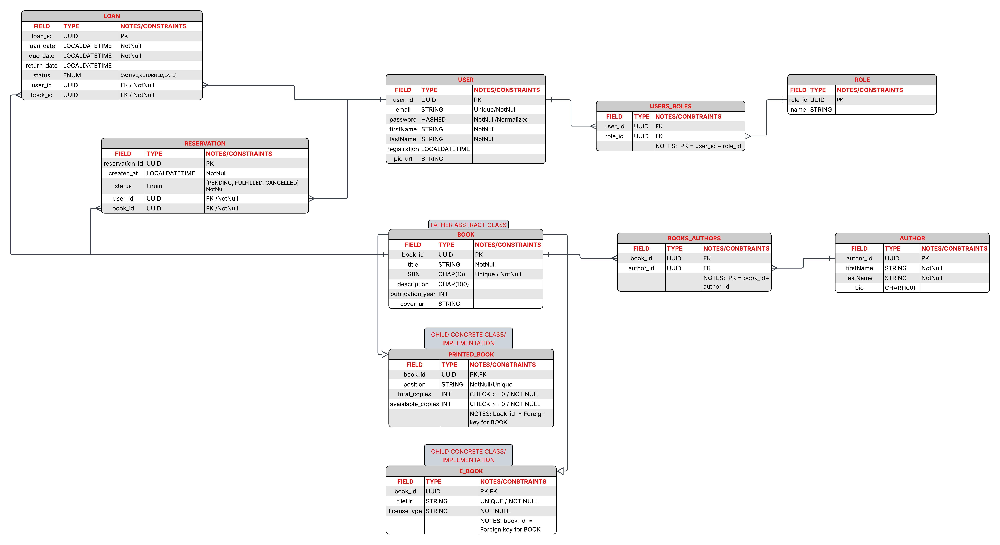
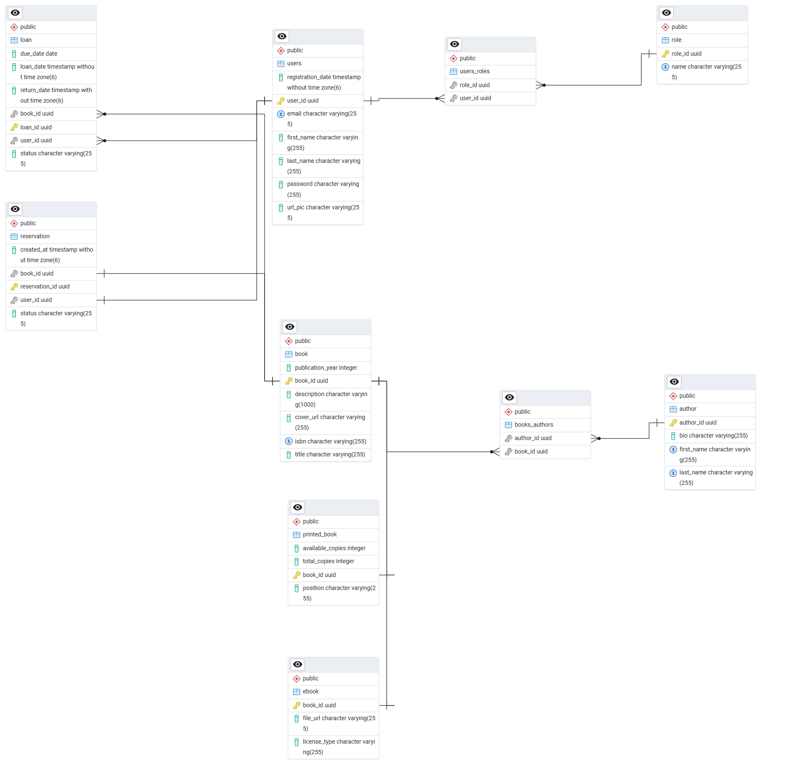

# LIBRARY365  
-[HOW TO](#how-to)

## PROJECT THEME

LIBRARY365 is a backend app to handle a library.  
It's main focus is to be a complete, scalable and secure app  
capable of doing all the operation of a modern library :  

- **Book Handling**  
- **Book Tracking**  
- **Loan**
- **User handling** 

The app was developed using Spring Boot as the main backend framework. As database, PostgresSQL was used.

The app was made keeping in mind **best practices**, **API REST**, **security**, **Data validation** and interaction with **external services**

Library365 could be integrated easily with an ecommerce platform or with any frontend app. 

This project was made as a part of Backend Programming exam and the main scope is to show the acquired skill:  

- **Domain design**
- **Data persistence**
- **JWT Authentication**
- **Relationship**
- **Inheritance and Polymorphism**
- **External API**
- **Advanced Query**
- **Rest API**
- **Endpoint Handling**
- **Security**

## DOMAIN 


The image show the Entity Relationship diagram.
The project includes 8 entities and 2 junction tables.
1) **User**: This entity represents typical library's user with main attributes such as name, surname, mail, password, etc...
2) **Role**: This table represents the User's role
3) **Users_Roles**: This is the junction table that link User and Role. It is used to divide an N:N relationship into two  1:N relationships  

4) **Loan**: This is the table for books loaning, linked to User's and Book's table. There are field for loan date, return date and for information about user and book 
5) **Reservation**: This is the table used when there are no book's available and one user reserve one copy for him. There are field for the loan status, a date for the reservation and info about user and book
6) **Book**: Abstract Class. Alongside User, this is one of the major entity of the project. Has field for title,ISBN, description, publication year and cover
7) **Printed_Book**: Concrete Class,"child" of Book, implementation of Book. This is a physical book. Has the same field of his "father" and other important field such as position in the physical library, total copies and available copies
8) **E_Book**:Concrete Class, "child" of Book, implementation of Book. Has the same field of his "father" with other important field such as url and licenseType

### Logic
The logic of the project is based over these entities.
We can have 3 different type of User: Admin, Librarian and User.  
**Admin**  can handle **Librarian**, **User**, **User activity** and the **Library**.  
**Librarian** can handle **User**, **User activity** and **Library**.  
**User** can only open / delete  **account** and make request about **Loans**, **Reservation** and see **Books** in the **Library**  

## ENTITY
The project is built around 8 main entities:  
1)  **User**
2)   **Loan**  
3)   **Role**
4)   **Reservation**
5)   **Book**  
6)   **Printed_Book**  
7)   **E_Book**  
8)   **Authors**

In the ERD as visible, there are 2 junction table. These table could have been created physically 
using following sql code :
```sql
CREATE TABLE users_roles (
    user_id UUID NOT NULL,
    role_id UUID NOT NULL,
    PRIMARY KEY (user_id, role_id),
    FOREIGN KEY (user_id) REFERENCES users(user_id),
    FOREIGN KEY (role_id) REFERENCES roles(role_id)
);

CREATE TABLE books_authors (
    book_id UUID NOT NULL,
    author_id UUID NOT NULL,
    PRIMARY KEY (book_id, author_id),
    FOREIGN KEY (book_id) REFERENCES book(book_id),
    FOREIGN KEY (author_id) REFERENCES author(author_id)
);

```

Due to the simplicity of the project, I preferred to use JPA  Manytomany annotations. 
In this way I followed the project guidelines regarding relationship. 

In the ERD is also showed an Inheritance between three entities:  
1)  **Book**  
2)  **Printed_Book**  
3)  **E_Book**  

Essentially, **Book** is an abstract class extended by **Printed_Book** (physical book of the library)
and **E_Book** (digital copy). I've used a **JOINED** approach, where the children have some common field with father.
This approach avoid **Null** field in table.

Every entity has its own attribute and constraints in order to have a smooth, logic and meaningful workflow.

  
In this file you can see how all the code I wrote about entities has translated in the following ERD created by pgAdmin.  
It was created at first glance (how lucky, without error ) and it is similar to the one I designed in the beginning  

### User
User was designed with some "fields".
This fields contributes on creating a full functionally profile. 

### Normalization : Entity, DTO, Services, Controller
Every Entity, DTO, Services and Controller was normalized following best practices.  
The best practices includes using of annotation like ```@NotBlank```, ```@Size``` and so on . This ensures no sensible information leaks outside and grant consistency 

## REST API's : CONTROLLER, REPOSITORY AND SERVICE 
This application exposes main functionality using CRUD operations (POST, GET,PATCH, PUT, DELETE ) taken from repositories and implementing it with other useful method.
Every entity, where possible, has its own Controller and its own Service. This fragmentation enhance modularity and code reusability, enhancing loose coupling

## AUTH 
For application's authorization I've used JWT token. In particularly, for Postman, I've used token Bearer.
In Project's folder there are 4 classes: ```JWTAuthFilter , JWTTools, SecurityConfig``` are classes used mainly to set up filter chain, token generations and to secure endpoint.  
```PasswordConfig``` was used to secure and crypt user's password.

## QUERIES
In repositories, alongside JPA method, I've used native sql query. I've not used any JPQL hybrid query cause they return me many errors.
Those errors are my fault. I've used many underscore and JPQL is very sensitive about underscore 

## ERROR HANDLING
I've protected the stack the best i could do. Mainly I've created in ```exceptions ``` folder many exception handler, even one for postmanstack

## 3RD PARTY APIs
For my project, I used cloudinary for storing profile images.I've also used google free api for retrieving book from a public database and insert it in my database. 

## HOW TO:
In this section I will tell you what do you need to set up the environment in order to test the app.  
1)```Intellij```: Download it from https://www.jetbrains.com/idea/download/?section=windows  
    Install it  , follow automatic configuration  
2)```PgAdmin and Postgre SQL``` : Download it from https://www.enterprisedb.com/downloads/postgres-postgresql-downloads  
Install it, configure it, open it, create a database   
3)```Postman```: Useful tool to test the app. Download it from https://www.postman.com/downloads/  
Install it, you do  need to create an account  
4)```Project ```: Download the folder from github.After that, you need to open the folder inside intellij. , unzip it. Open intellij, open the unzipped folder.  After you open it, you need to import dependencies. Usually intellij do this automatically. You can see the progress in the right bottom corner of intellij     
5)```Env.properties```: I've left an env.properties example file in resources folder . You need to rename it exactly ```env.properties```  
In the fields inside the file , you need to add:  
```DB_URL= (after the = you need to put the database url, usually beginning with jdbc:postgresql://localhost:5432/db_name. Check it inside pgadmin Setting )```  
```DB_USERNAME=(username used to log inside pgAdmin)```    
```DB_PASSWORD=(password used to log inside pgAdmin)```    
```JWT_SECRET=use a 32 characters string with numbers, special characters and variety of upper and lowercase letter```  
```CLOUDINARY_NAME=(log or register to cloudinary, you will find this info in dashboard)```  
```CLOUDINARY_SECRET=(log or register to cloudinary, you will find this info in dashboard)```  
```CLOUDINARY_KEY=(log or register to cloudinary, you will find this info in dashboard)```  
6)Inside resources folder , you will find the postman collection. If you want to run the app, you need to import this file through postman import command.  
7)Postman instruction: I suggest , in order to test postman, to use a txt file, where you past authorization token, user_id or book_id. Usually the request require a user_id, an author_id ,an access token, a book_id and a body.I've left some example, so you do not have any difficulties to do that 
8)Before going with postman request, remember to start the app from the entry point ```Library365Application```
9) In case you do not have any JDK installed, intellij will suggest to download it. You can use the one suggested from intellij or you can manually install it one 